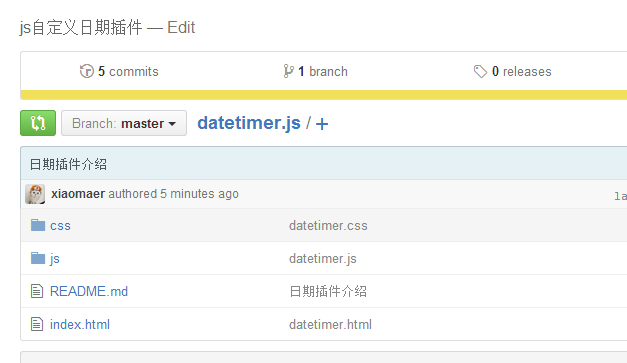
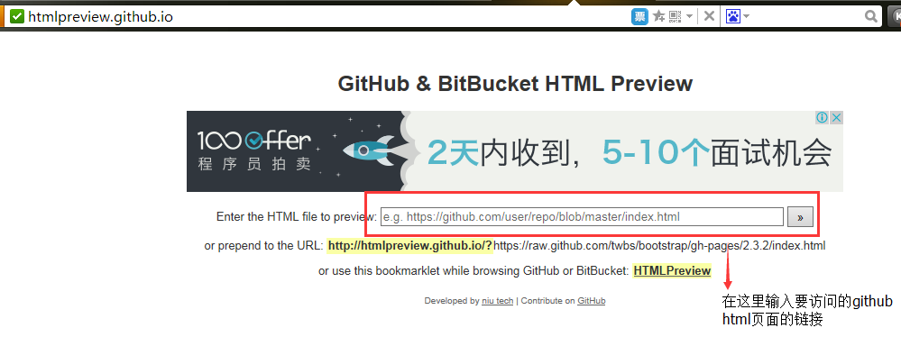
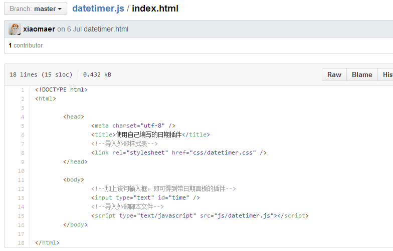
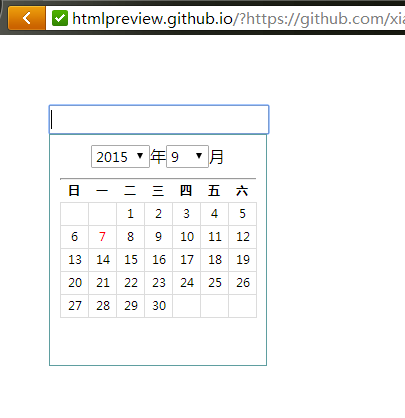

###如何直接在github上预览html网页效果？

在github上托管的项目, 经常会存放一些demo的html文件在里面, 比如像下面这样的:   

>我们直接点击的话只能看到html源代码, 那么有没有什么办法直接看html网页效果而不用下载呢?  
>答案是有的。它就是:`http://htmlpreview.github.io/`。 直接把github上html文件的链接复制过去即可。  

打开“`http://htmlpreview.github.io/`”网页,如下图所示：  

例如：Github上有这么一个HTML文件https://github.com/xiaomaer/datetimer.js/blob/master/index.html, 如果直接访问是这样的:  

>只有把该链接“https://github.com/xiaomaer/datetimer.js/blob/master/index.html”放到这个链接“http://htmlpreview.github.io/”打开的页面中，才可以预览网页效果。  
>或者直接访问“http://htmlpreview.github.io/?https://github.com/xiaomaer/datetimer.js/blob/master/index.html”该链接才可以预览网页效果。即在原来链接之前添加http://htmlpreview.github.io/?。  
效果如下所示：  

